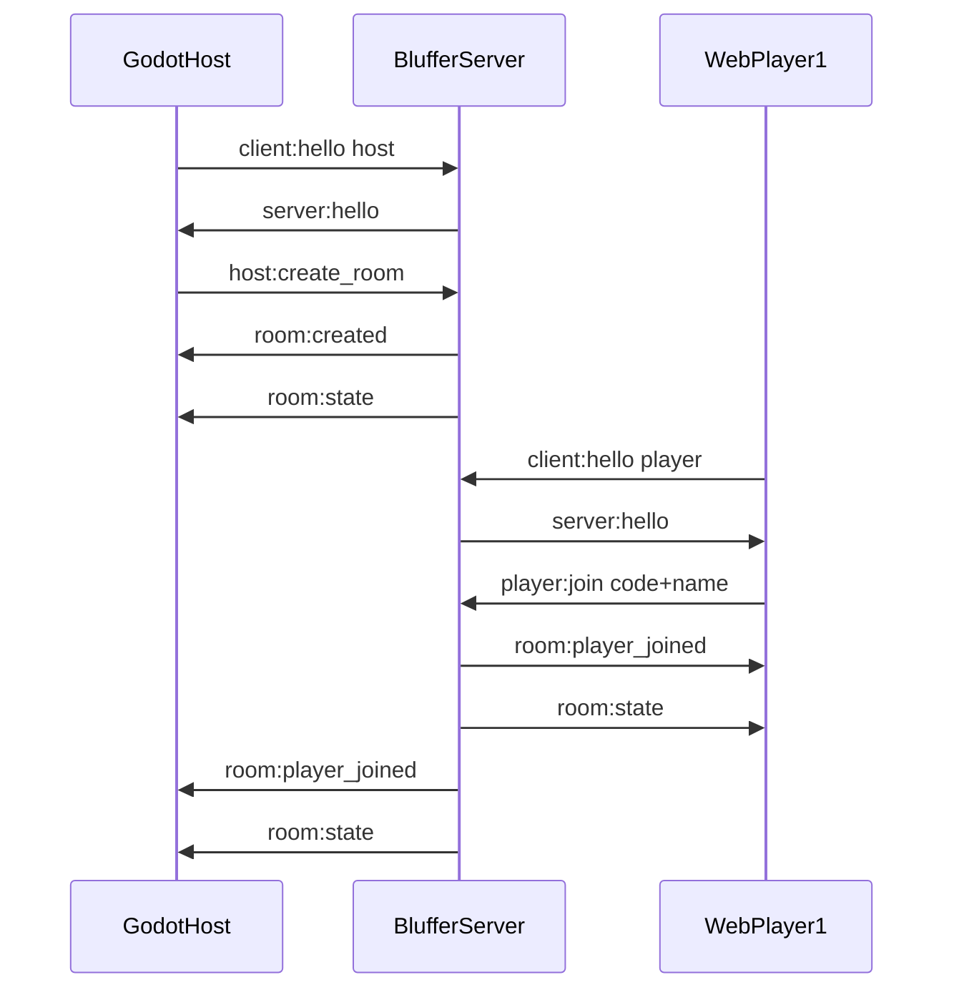

# Bluffer WebSocket Protocol

Protocol version: **2**

This document defines the wire contract between the Bluffer server, the Godot host app, and web player controllers.

## Transport

- Endpoint: `ws://<host>:<port>/ws`
- Format: JSON text frames
- Encoding: UTF-8 (Persian/RTL text supported)

## Message Envelope

All messages use this shape:

```json
{
  "type": "message:type",
  "payload": {},
  "requestId": "optional-correlation-id"
}
```

`requestId` is optional on client messages. When provided, related `server:error` responses include the same id.

## Connection Handshake

Every connection must send `client:hello` as its **first** message within 10 seconds.



### client:hello

```json
{ "type": "client:hello", "payload": { "role": "host" } }
```

Roles: `"host"` | `"player"`

### server:hello

```json
{
  "type": "server:hello",
  "payload": {
    "connectionId": "uuid",
    "protocolVersion": 2
  }
}
```

## Client → Server Messages

| Type | Role | Payload |
|------|------|---------|
| `client:hello` | both | `{ "role": "host" \| "player" }` |
| `host:create_room` | host | `{ "maxPlayers"?: number }` |
| `host:close_room` | host | `{}` |
| `host:kick_player` | host | `{ "playerId": string }` |
| `host:start_game` | host | `{ "rounds"?: number }` default 3 |
| `host:end_game` | host | `{}` |
| `host:next_round` | host | `{}` skip score wait |
| `host:reconnect` | host | `{ "roomId": string, "hostToken": string }` |
| `player:join` | player | `{ "roomCode": string, "name": string }` |
| `player:leave` | player | `{}` |
| `player:reconnect` | player | `{ "roomCode": string, "sessionToken": string }` |
| `player:submit_lie` | player | `{ "text": string }` max 120 chars |
| `player:cast_vote` | player | `{ "optionId": string }` |

### host:create_room

Creates a lobby room. Default `maxPlayers` is 8 (max 16). Server also sends `host:session` with reconnect credentials.

### host:start_game

Requires at least **2 connected players**. Starts the Fibbage-style round loop.

### player:join

- Cannot join while a game is in progress
- Server sends `player:session` with `sessionToken` for reconnection

### player:reconnect / host:reconnect

Reconnect within 60 seconds of disconnect using session tokens issued at join/create.

## Server → Client Messages

| Type | Recipients | Purpose |
|------|------------|---------|
| `server:hello` | sender | Handshake ack |
| `room:created` | host | `{ roomCode, roomId }` |
| `host:session` | host | `{ roomId, hostToken }` |
| `player:session` | player | `{ playerId, sessionToken }` |
| `room:state` | all in room | Authoritative snapshot |
| `game:started` | all in room | `{ totalRounds }` |
| `round:prompt` | all in room | `{ round, promptId, text, submitDeadline }` |
| `round:submit_ack` | submitter | `{ accepted: true }` |
| `round:vote_options` | per player | `{ options: [{ id, text }] }` — excludes own lie |
| `round:reveal` | all in room | `{ truth, entries }` |
| `round:scores` | all in room | `{ roundScores, totals }` |
| `game:ended` | all in room | `{ totals, reason }` |
| `room:player_joined` | all in room | `{ player }` |
| `room:player_left` | all in room | `{ playerId }` |
| `room:closed` | all in room | Room destroyed |
| `server:error` | sender | `{ code, message, requestId? }` |

### room:state (authoritative snapshot)

```json
{
  "type": "room:state",
  "payload": {
    "roomId": "uuid",
    "roomCode": "ABCD",
    "phase": "lobby",
    "hostConnected": true,
    "players": [
      { "id": "uuid", "name": "امیر", "connected": true, "score": 0 }
    ],
    "maxPlayers": 8,
    "createdAt": "2026-06-11T18:00:00.000Z",
    "round": 1,
    "totalRounds": 3,
    "phaseDeadline": "2026-06-11T18:01:30.000Z",
    "submitProgress": { "submitted": 1, "total": 2 },
    "voteProgress": { "voted": 0, "total": 2 }
  }
}
```

Clients should render lobby UI from `room:state` whenever it arrives.

Phases: `"lobby" | "prompt" | "submit" | "vote" | "reveal" | "score"`

### room:closed

Sent when:
- Host calls `host:close_room`
- Host grace period (60s) expires after disconnect
- Player is kicked (kicked player only, with reason)

```json
{
  "type": "room:closed",
  "payload": {
    "roomId": "uuid",
    "reason": "Host disconnected"
  }
}
```

## Error Codes

| Code | Meaning |
|------|---------|
| `INVALID_MESSAGE` | Malformed JSON or schema violation |
| `HANDSHAKE_REQUIRED` | First message was not `client:hello` |
| `HANDSHAKE_TIMEOUT` | No hello within 10 seconds |
| `INVALID_ROLE` | Unknown role |
| `ROOM_NOT_FOUND` | Invalid or unknown room code |
| `ROOM_FULL` | Room at capacity |
| `NAME_TAKEN` | Duplicate name in room |
| `NAME_INVALID` | Empty or too-long name |
| `NOT_IN_ROOM` | Action requires room membership |
| `NOT_HOST` | Action requires host role |
| `HOST_ALREADY_HAS_ROOM` | Host already created a room |
| `PLAYER_NOT_FOUND` | Player id not in room |
| `UNAUTHORIZED` | Wrong role or already in room |
| `INVALID_PHASE` | Action not allowed in current phase |
| `NOT_ENOUGH_PLAYERS` | Fewer than 2 players to start |
| `GAME_NOT_ACTIVE` | No game in progress |
| `GAME_ALREADY_ACTIVE` | Game already running or join blocked |
| `LIE_INVALID` | Empty or too-long lie |
| `ALREADY_SUBMITTED` | Duplicate lie submission |
| `ALREADY_VOTED` | Duplicate vote |
| `INVALID_VOTE` | Invalid vote option |
| `RECONNECT_FAILED` | Reconnect credentials invalid |
| `SESSION_EXPIRED` | Reconnect grace period expired |
| `INTERNAL_ERROR` | Unexpected server failure |

## HTTP Endpoints

| Method | Path | Response |
|--------|------|----------|
| GET | `/health` | `{ "status": "ok", "version": "0.1.0" }` |
| GET | `/rooms/:code` | `{ "exists": true, "playerCount": 2, "phase": "lobby" }` or 404 |
| GET | `/questions/stats` | `{ "count": 24 }` |

Use `/rooms/:code` on the web join page before opening a WebSocket.

## Godot Host Example (GDScript 4)

```gdscript
var socket := WebSocketPeer.new()

func connect_to_server(url: String) -> void:
    socket.connect_to_url(url)

func _process(_delta: float) -> void:
    socket.poll()
    if socket.get_ready_state() != WebSocketPeer.STATE_OPEN:
        return
    while socket.get_available_packet_count() > 0:
        var packet = socket.get_packet().get_string_from_utf8()
        _handle_message(JSON.parse_string(packet))

func send_hello() -> void:
    _send({ "type": "client:hello", "payload": { "role": "host" } })

func create_room() -> void:
    _send({ "type": "host:create_room", "payload": {} })

func _send(data: Dictionary) -> void:
    socket.send_text(JSON.stringify(data))
```

Connect to `ws://localhost:3000/ws`, send hello, then create room. Display `roomCode` from `room:created` and refresh lobby UI on every `room:state`.

## Browser Player Example

```javascript
const ws = new WebSocket("ws://localhost:3000/ws");

ws.onopen = () => {
  ws.send(JSON.stringify({ type: "client:hello", payload: { role: "player" } }));
};

ws.onmessage = (event) => {
  const message = JSON.parse(event.data);
  if (message.type === "server:hello") {
    ws.send(JSON.stringify({
      type: "player:join",
      payload: { roomCode: "ABCD", name: "امیر" },
    }));
  }
  if (message.type === "room:state") {
    renderLobby(message.payload);
  }
};
```

Set `dir="rtl"` on text inputs for Persian names.

## Versioning

- Bump `protocolVersion` in `server:hello` on breaking changes
- Add new message types and optional fields in a backward-compatible way when possible
- Phase 2 will extend `phase` beyond `"lobby"` to `"prompt" | "submit" | "vote" | "reveal"`

## Scoring

| Event | Points |
|-------|--------|
| Fool a player with your lie | +100 per fooled player |
| Pick the true answer | +500 |

## Phase Timers (defaults)

| Phase | Duration |
|-------|----------|
| prompt | 3s |
| submit | 90s |
| vote | 30s |
| reveal | 10s |
| score | 10s (auto-advance) |

Configurable via environment variables (see `.env.example`).

## Phase 2 Limitations

- In-memory rooms only (lost on server restart)
- Host disconnect: 60s reconnect grace before room closes
- Player disconnect during game: 60s reconnect grace; marked disconnected
- Cannot join mid-game
- No authentication
